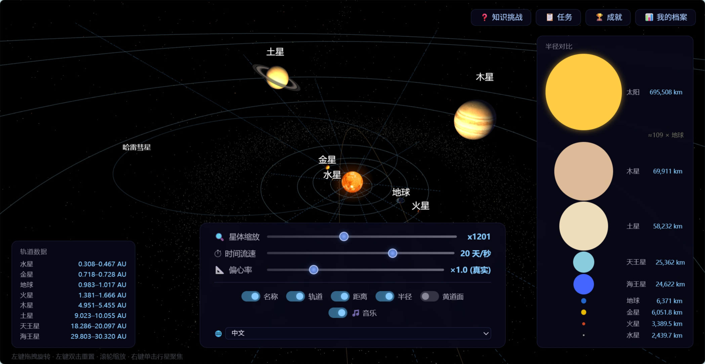
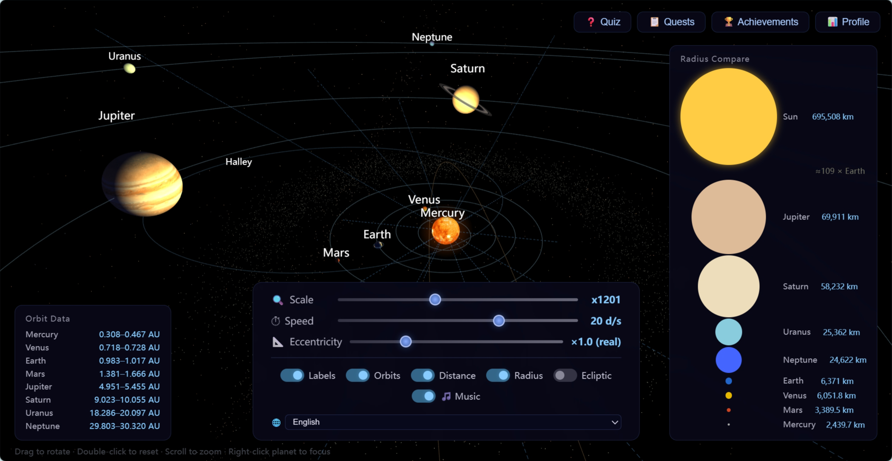
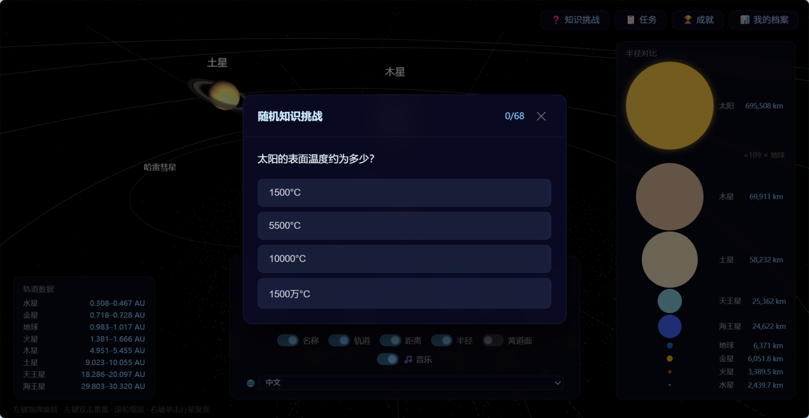
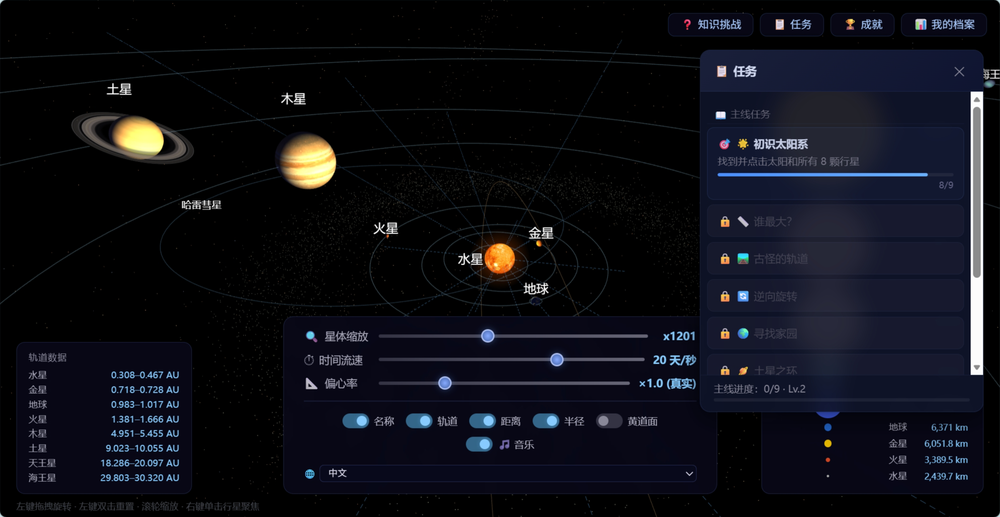
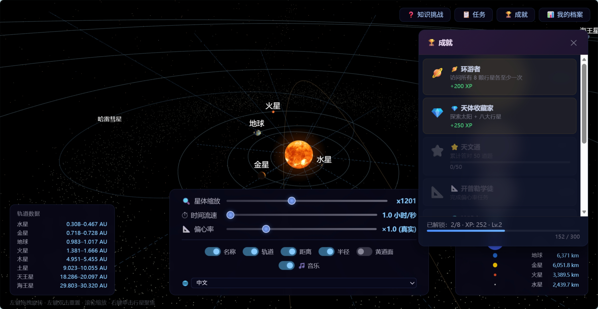
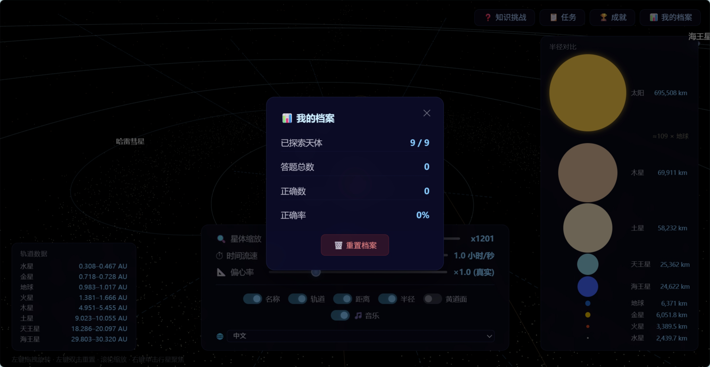

<div align="center">

# 🪐 3D 太阳系互动百科

[](LICENSE)
[](https://threejs.org/)

*一个可探索的 3D 太阳系 —— 在浏览器中漫游宇宙，学习天文知识*

[🇬🇧 English version](README.en.md)

</div>

---

## 📖 简介

这是一个交互式 3D 太阳系网页应用，基于 **Three.js** 构建。你可以在三维空间中自由漫游，观察行星公转、查阅天体百科、完成探索任务、挑战天文知识问答。

## ✨ 功能

| 截图 | 说明 |
|------|------|
|  | 默认场景 — 8 大行星沿轨道公转 |
|  | 一键切换英文界面 |

- **8 大行星 + 太阳** — 精确轨道模拟（基于 JPL HORIZONS 数据），包含真实偏心率、倾角、轴倾角
- **NASA 纹理** — 行星表面、土星环、月球均使用真实纹理贴图
- **大气效果** — 地球有半透明大气光晕，太阳有脉冲光晕
- **双语支持** — 中文 / English，随时切换
- **信息卡片** — 点击任意天体查看半径、质量、大气成分等详细数据，支持跨天体比较
- **知识问答** — 68 道天文选择题，支持按天体筛选
- **探索任务** — 13 个主线+支线任务，引导探索
- **成就系统** — 10 个成就，含 2 个隐藏成就
- **彗星系统** — 哈雷彗星、海尔波普彗星，带动态彗尾
- **音效 & 音乐** — 环境太空背景音乐 + 交互音效
- **小行星带** — 5000 颗小行星，带轨道倾角分布

## 🛠️ 技术栈

| 层 | 技术 |
|---|------|
| 渲染引擎 | Three.js 0.132.2 |
| CSS 标签 | CSS2DRenderer |
| 构建工具 | Webpack 5 |
| 本地化 | 自制 i18n 模块 |
| 音效 | Web Audio API |

## 🚀 快速开始

```bash
git clone https://github.com/q-jade/solar-system.git
cd solar-system
npm install
npm start          # 开发模式，热更新
# 或
npm run build      # 生产构建
npm run serve      # 本地预览构建产物
```

开发服务器默认运行在 `http://localhost:8081`。

## 📦 项目结构

```
solar-system/
├── src/
│   ├── js/          # JavaScript 源码
│   ├── data/        # 天体与题库数据
│   ├── locales/     # 语言包
│   ├── textures/    # 纹理贴图
│   └── css/         # 样式
├── docs/images/     # 截图
├── dist/            # 构建产物（生成）
└── webpack.config.js
```

## 📷 更多截图

| | |
|---|---|
|  知识问答（68 题） |  探索任务（13 个） |
|  成就系统（10 个） |  个人档案 |

## 📄 许可证

本项目采用 **MIT 许可证** —— 详情请见 [LICENSE](LICENSE)。

